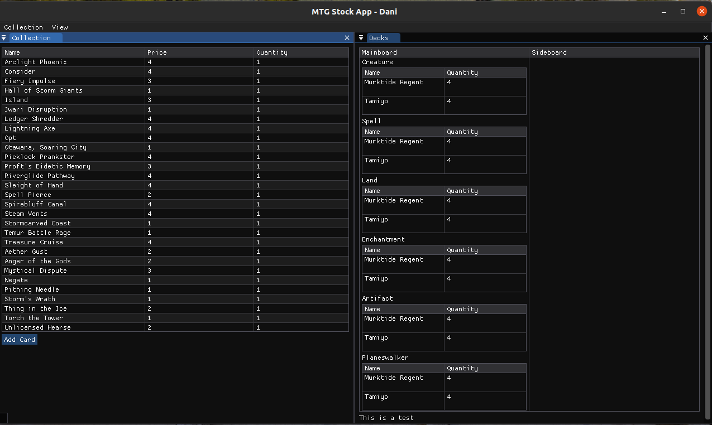

# mtg-stock-app [Work in progress]

An app develop in C++ to visualize your Magic the gathering stock. 

# What's this about

Having a large collection of cards can be something tricky to manage, specially if you have the card listed in some site, such as Cardmarket. 

The objective behind this app is to have a database where the user can visualise and alter its Magic collection. They key functionalities that this app have:

- Listing of user magic collection. [x]
- Can make simple changes such as price updades, etc. []
- Have an idea of current market prices (The app will display the current trend price of magic cards from Scryfall API) []
- Let the user updade prices to an account such as card market. []

# Requirements 

To run the application, you will need to have the following requirements:

- CMake >= 3.16.3:

# Build

1) Create a build folder:
   
```bash
   mkdir build/
```

2) Execute the `run.py` script. This will build the project and run it:

```bash
   ./run.py
```

# Images

This what the app looks like currently (not pretty, I know):



